# Medieval Combat Simulator Character Creator & Game Master

A comprehensive full-stack RPG gaming platform inspired by the Medieval Combat Simulator system. This application allows players to create characters, form parties, manage inventory, engage in combat, interact with NPCs, and play with an AI-powered Game Master.

## 🎮 Features

### Character Creation & Management

- **Species Selection**: Choose from 15+ fantasy races including Humans, Elves, Dwarves, Wolf, Champions, Heavy Fighters, and more
- **Advanced Attribute Rolling**:
  - Species-specific dice rolls (3d6, 4d6, 5d6)
  - Bonus dice for exceptional rolls (highlighted attributes)
  - Auto-roll feature with minimum total targeting
  - Cryptographic randomness option for true RNG
- **profession (Occupational Character Class) System**:
  - Men of Arms: Soldier, Mercenary, Knight, Paladin, Ranger, Long Bowman, Thief, Assassin
  - Men of Training: Duelist, Mercenary, Diabolist, Summoner, Illusionist, Witch
  - Clergy: Priest of Light, Priest of Darkness, Druid, Shaman, Healer
  - Tactical: Tactician
  - Optional: Scholar, Merchant, Noble, Peasant, Squire
- **Dynamic Class Filtering**: Automatic filtering based on race restrictions and attribute requirements
- **Skill System**:
  - profession Skills (automatic)
  - Elective Skills (class-specific choices)
  - Secondary Skills (general skills pool)
  - Level-based skill progression
- **Character Backgrounds**:
  - Social Background
  - Disposition
  - Personal Hostility
  - Land of Origin
  - Age determination by species
- **Level Progression System (1-15)**:
  - HP progression by level
  - Attacks per melee increase
  - Combat bonuses (attack, block, evade, damage)
  - Saving throws improvements
  - stamina/focus growth for training users
  - Skill increases at specific levels
- **Bulk Character Generation**: Create multiple NPCs or party members at once

### Party System

- **Party Management**: Create and manage adventuring parties
- **Party Builder**: Assign characters to parties
- **Party Inventory**: Shared inventory and resource management
- **Party Chat**: Group communication system
- **Party-based Quests**: Track party objectives and progress

### Combat System

- **Initiative Tracker**: Automated turn order based on character speed and bonuses
- **Combat Actions**:
  - Attack, Block, Evade mechanics
  - Critical hits and fumbles
  - Called shots
  - Multiple attacks per combat round
- **Combat Panel**: Real-time combat management interface
- **Combat Techniques**: Integrated technique casting in combat
- **Combat Logs**: Historical record of battles
- **Damage Tracking**: Automatic HP management

### Equipment & Economy

- **Equipment Shop**: Purchase weapons, armor, and gear
- **Weapon Shop**: Specialized weapon marketplace with stats
- **Trader Shop**: General goods and supplies
- **Merchant System**: NPC merchants with dynamic inventory
- **Starting Equipment**: Class-based initial gear
- **Inventory Management**:
  - Carry weight calculations based on PS
  - Equipment slots
  - Item quality and condition
- **Currency System**: Gold-based economy with class-specific starting funds

### Training & Tactics

- **Technique System**:
  - Multiple technique levels and types
  - stamina (Potential Psychic Energy) tracking
  - Technique casting interface
  - Combat and utility techniques
- **Tactics System**:
  - focus (Inner Strength Points) tracking
  - Tactical abilities
  - Tactician powers
  - IQ-based tactical potential rolls

### AI Game Master

- **OpenAI Integration**: GPT-powered Game Master
- **RAG System** (Retrieval-Augmented Generation):
  - Vector embeddings for game rules
  - Semantic search for rulebook queries
  - Context-aware responses
- **Dynamic Storytelling**: AI-generated quests and narratives
- **NPC Interactions**: Intelligent NPC dialogue and behavior
- **NPC Memory System**: Persistent NPC memory of interactions
- **Quest Generation**: Automated quest creation and tracking

### World & Exploration

- **Interactive World Map**: 3D globe visualization with locations
- **Starting Locations**: Multiple campaign starting points
- **Encounter System**: Random and scripted encounters
- **Encounter Tables**: Level-appropriate challenges
- **Arena Roster**: Comprehensive opponent database with stats
- **Time Tracking**: In-game time and calendar system
- **Rest System**: Short and long rest mechanics

### User System

- **User Authentication**: Secure login/registration
- **JWT Token-based Auth**: Protected routes and sessions
- **Character Lists**: Personal character library
- **User Profiles**: Track player progress and characters

### Data & Content

- **Comprehensive Rules Database**:
  - Race data with bonuses and abilities
  - profession data with skills and progression
  - Skills database with descriptions
  - Weapons and armor stats
  - Combat actions reference
  - Movement rules
  - Technique compendium
  - Arena Roster (animals, heavys, opponents)
  - NPC archetypes and templates
- **Preprocessed Datasets**: Optimized for AI queries (JSON, JSONL, TXT, MD formats)
- **Cross-references**: Linked game rules and mechanics

## 🛠️ Technology Stack

### Frontend

- **React 18**: Component-based UI framework
- **Vite**: Fast build tool and dev server
- **React Router**: Client-side routing
- **Chakra UI**: Modern component library
- **Three.js**: 3D world map visualization
- **CSS Modules**: Scoped styling

### Backend

- **Node.js**: Runtime environment
- **Express.js**: Web application framework
- **MongoDB**: NoSQL database
- **Mongoose**: MongoDB ODM
- **OpenAI API**: AI Game Master integration
- **Swagger**: API documentation

### AI & RAG

- **OpenAI Embeddings**: Vector embeddings for semantic search
- **Pinecone/Vector DB**: Vector storage for RAG
- **Custom Prompt Engineering**: Game Master personality and rules
- **Context Management**: Conversation history and memory

### Authentication & Security

- **JWT**: JSON Web Tokens for auth
- **bcrypt**: Password hashing
- **Express middleware**: Auth guards and validation

## 📁 Project Structure

```
charcreat/
├── backend/
│   ├── config/          # Database configuration
│   ├── conchampioners/     # Route conchampioners
│   ├── data/            # Game data (JSON)
│   ├── middleware/      # Auth, validation, error handling
│   ├── models/          # Mongoose schemas
│   ├── routes/          # API endpoints
│   ├── scripts/         # Utility scripts (seeding, building indices)
│   ├── server/
│   │   ├── prompt/      # AI prompt templates
│   │   ├── rag/         # RAG implementation
│   │   └── tools/       # AI tools and functions
│   ├── shared/          # Shared utilities
│   └── server.js        # Entry point
│
├── src/
│   ├── components/      # React components
│   ├── context/         # React context providers
│   ├── data/            # Frontend game data
│   ├── engine/          # Game logic (encounters, etc.)
│   ├── hooks/           # Custom React hooks
│   ├── pages/           # Page components
│   ├── services/        # API services
│   ├── styles/          # CSS files
│   ├── utils/           # Utility functions
│   └── main.jsx         # React entry point
│
├── public/              # Static assets
├── exports/             # Character exports
└── scripts/             # Build scripts
```

## 🚀 Getting Started

### Prerequisites

- Node.js (v16 or higher)
- MongoDB (local or Atlas)
- OpenAI API key (for AI Game Master features)

### Installation

1. **Clone the repository**

```bash
git clone <repository-url>
cd charcreat
```

2. **Install dependencies**

```bash
# Install backend dependencies
cd backend
npm install

# Install frontend dependencies
cd ..
npm install
```

3. **Environment Configuration**

Create a `.env` file in the `backend` directory:

```env
MONGODB_URI=mongodb://localhost:27017/medieval_combat_simulator
JWT_SECRET=your_jwt_secret_here
OPENAI_API_KEY=your_openai_api_key_here
PORT=5000
```

4. **Seed the database** (optional)

```bash
cd backend
node scripts/reseedShop.js
node scripts/reseedWeapons.js
node scripts/buildGMIndex.js  # Build RAG index
```

5. **Run the application**

Backend:

```bash
cd backend
npm start
```

Frontend:

```bash
npm run dev
```

Access the application at `http://localhost:5173`

## 🎲 How to Play

### Creating a Character

1. Navigate to **Character Creation**
2. Enter a character name and select gender
3. Choose a **species** (each has unique attributes)
4. Select **alignment** (Good, Shumanish, or Evil)
5. **Roll attributes** (or use auto-roll for minimum totals)
6. **Roll bonus dice** for exceptional attributes
7. Roll **background information** (age, social background, disposition, etc.)
8. Roll for **tactics** (if applicable)
9. Select an **profession** (filtered by race and attributes)
10. Choose **skills** (elective and secondary)
11. Set your **character level** (1-15) to see projected stats
12. **Create character** to save to database

### Building a Party

1. Go to **Party Builder**
2. Create a new party
3. Add characters from your character list
4. Manage party inventory and resources
5. Use **Party Chat** for roleplay

### Using the AI Game Master

1. Navigate to **GM Assistant**
2. Start a conversation with the AI
3. Ask about rules, request quests, or interact with NPCs
4. The GM uses RAG to reference official rules
5. NPC memories persist across sessions

### Combat

1. Use the **Combat Panel** to initiate encounters
2. **Initiative Tracker** automatically orders turns
3. Select combat actions from the **Combat Actions Panel**
4. Track HP, damage, and status effects
5. View **Combat Log** for battle history

### Shopping & Equipment

1. Visit **Equipment Shop**, **Weapon Shop**, or **Trader Shop**
2. Browse items with full stats
3. Purchase gear (checks gold and carry weight)
4. Manage inventory in **Inventory Manager**

## 🗺️ Game Features

### Races Available

Human, Human, Human, Human, Wolf, Brigand, Brigand, Hob-Brigand, Raider, Heavy Fighter, Champion, Cave Fighter, Duelist, Scout, Sprite

### Combat Mechanics

- **Attacks per Melee**: Increases with level and skills
- **Bonuses**: Attack, Block, Evade, Damage, Initiative
- **Saving Throws**: vs Training, Poison, Tactics, Horror
- **Critical Hits**: Natural 20 mechanics
- **Called Shots**: Target specific body parts

### Character Progression

- **15 Levels** with distinct power increases
- **HP Growth**: Based on PE and level
- **Skill Percentages**: Improve with IQ bonuses and level
- **Combat Prowess**: More attacks and better bonuses
- **Training Power**: stamina increases for techniquecasters
- **Tactical Strength**: focus grows for psychics

## 📚 API Documentation

API documentation is available via Swagger UI when the backend is running:

```
http://localhost:5000/api-docs
```

### Main Endpoints

- `/api/users` - User management
- `/api/characters` - Character CRUD operations
- `/api/parties` - Party management
- `/api/shop` - Shop and merchants
- `/api/chat` - AI Game Master chat
- `/api/npc` - NPC interactions
- `/api/combat` - Combat logging

## 🧪 Scripts

### Backend Scripts

- `buildGMIndex.js` - Build vector embeddings for RAG
- `reseedShop.js` - Reset shop inventory
- `reseedWeapons.js` - Reset weapon shop
- `clearShop.js` - Clear all shops
- `seedItems.js` - Seed items database
- `checkWeapons.js` - Validate weapon data

## 🎨 UI Components

### Core Components

- **CharacterCreator** - Full character creation duelist
- **CharacterList** - Browse and manage characters
- **PartyBuilder** - Create and manage parties
- **GMAssistant** - AI Game Master interface
- **CombatPanel** - Combat encounter management
- **EquipmentShop** - Shop interface
- **WorldMap** - 3D interactive map
- **NPCChat** - Talk to NPCs
- **QuestTracker** - Track active quests
- **ArenaRosterPanel** - Opponent reference
- **InitiativeTracker** - Turn order in combat

## 🤝 Contributing

This is a fan project based on Medieval Combat Simulator rules. Contributions are welcome!

## ⚖️ Legal & Acknowledgments

### Disclaimers

- This project is a **fan creation** and is **not affiliated with or endorsed by Original game content**.
- Game mechanics, species attributes, and rules are based on the Medieval Combat Simulator system published by Original game content.
- All game rules and mechanics are property of Original game content.
- This project is for **educational and entertainment purposes only**.

### Credits

- **Original game content** - Original RPG system and rules
- **OpenAI** - GPT models for AI Game Master
- **ChatGPT** - Assisted in code generation and project structure
- Community contributors and playtesters

## 📄 License

This project is open-source and available under the MIT License for the code. Game content and rules remain property of Original game content.

---

**Version**: 2.0  
**Last Updated**: 2025  
**Game System**: Medieval Combat Simulator (based on 1st/2nd Edition rules)

## 🧭 Astaminandix — System Diagrams

### ⚙️ 1. Combat Round Flow Overview

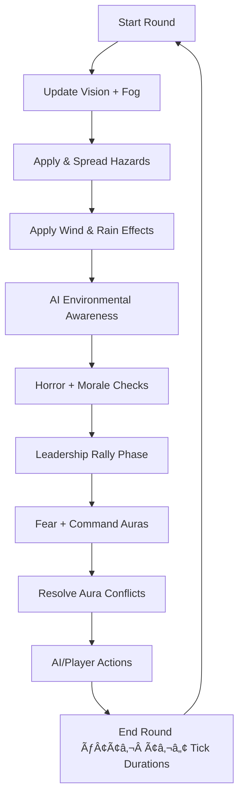
```mermaid
flowchart TD
    Start[Start Round] --> Vision[Update Vision + Fog]
    Vision --> Hazard[Apply & Spread Hazards]
    Hazard --> Weather[Apply Wind & Rain Effects]
    Weather --> AIEnv[AI Environmental Awareness]
    AIEnv --> Morale[Horror + Morale Checks]
    Morale --> Leadership[Leadership Rally Phase]
    Leadership --> Auras[Fear + Command Auras]
    Auras --> AuraConflict[Resolve Aura Conflicts]
    AuraConflict --> Actions[AI/Player Actions]
    Actions --> EndRound[End Round → Tick Durations]
    EndRound --> Start
```

---

### 👁️ 2. Line of Sight and Shared Vision

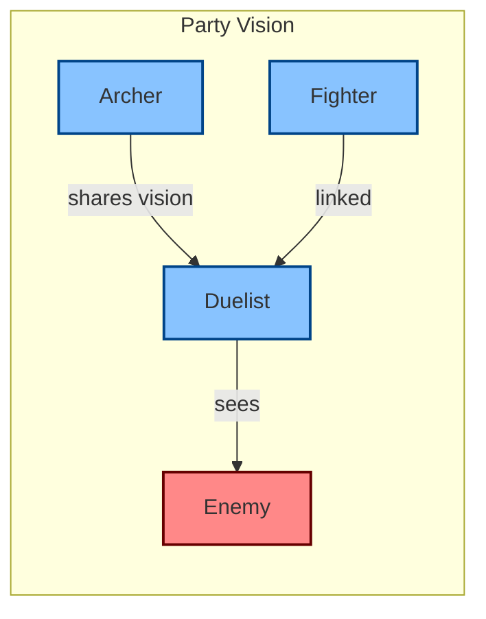
```mermaid
graph LR
    subgraph Party Vision
    A[Duelist] -->|sees| E[Enemy]
    B[Archer] -->|shares vision| A
    C[Fighter] -->|linked| A
    end
    style A fill:#88c3ff,stroke:#004488,stroke-width:2px
    style B fill:#88c3ff,stroke:#004488,stroke-width:2px
    style C fill:#88c3ff,stroke:#004488,stroke-width:2px
    E:::enemy
    classDef enemy fill:#ff8888,stroke:#660000,stroke-width:2px
```

Allies share any enemy detected by linked party members.

---

### 💥 3. AoE Technique Propagation

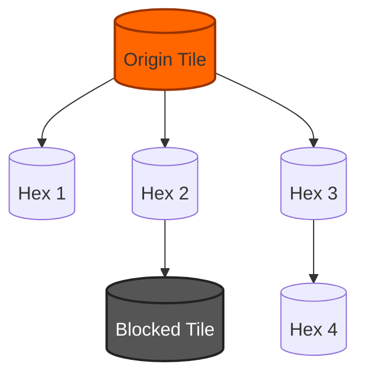
```mermaid
graph TD
    Center[(Origin Tile)]:::fire --> A1[(Hex 1)]
    Center --> A2[(Hex 2)]
    Center --> A3[(Hex 3)]
    A2 --> A4[(Blocked Tile)]:::rock
    A3 --> A5[(Hex 4)]
    style Center fill:#ff6600,stroke:#993300
    classDef fire fill:#ff6600,stroke:#993300,stroke-width:2px
    classDef rock fill:#555555,stroke:#222222,stroke-width:2px,color:#ffffff
```

Propagation halts when it hits cover ≥ 0.8 (rock, cliff, etc.).

---

### 🌋 4. Fire and Smoke Spread (per Turn)

```mermaid
flowchart LR
    FireTile((🔥)) -->|35% chance| Forest1🌲
    FireTile -->|50% chance| Smoke1(🌫️)
    Smoke1 -->|spread| Smoke2(🌫️)
    FireTile -.blocked by water/rock.-> Stop
    style FireTile fill:#ff6600,stroke:#993300
```

Fire ignites adjacent flammables; smoke expands unless blocked. Wind/humidity modify spread odds.

---

### 🌬️ 5. Wind & Weather Influence

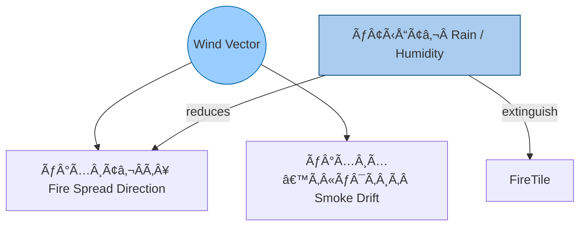
```mermaid
graph TD
    WindDir((Wind Vector)) --> FireSpread[🔥 Fire Spread Direction]
    WindDir --> SmokeDrift[🌫️ Smoke Drift]
    Rain[☔ Rain / Humidity] -->|reduces| FireSpread
    Rain -->|extinguish| FireTile
    style WindDir fill:#99ccff,stroke:#0066aa
    style Rain fill:#aaccee,stroke:#004477
```

---

### 🤖 6. AI Environmental Awareness

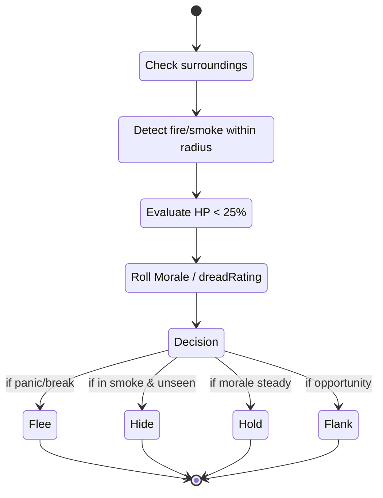
```mermaid
stateDiagram-v2
    [*] --> Scan
    Scan: Check surroundings
    Scan --> HazardCheck
    HazardCheck: Detect fire/smoke within radius
    HazardCheck --> LowHP
    LowHP: Evaluate HP < 25%
    LowHP --> MoraleEval
    MoraleEval: Roll Morale / dreadRating
    MoraleEval --> Decision
    Decision --> Flee: if panic/break
    Decision --> Hide: if in smoke & unseen
    Decision --> Hold: if morale steady
    Decision --> Flank: if opportunity
    Flee --> [*]
    Hide --> [*]
    Hold --> [*]
    Flank --> [*]
```

---

### 🧠 7. Morale & Leadership Flow

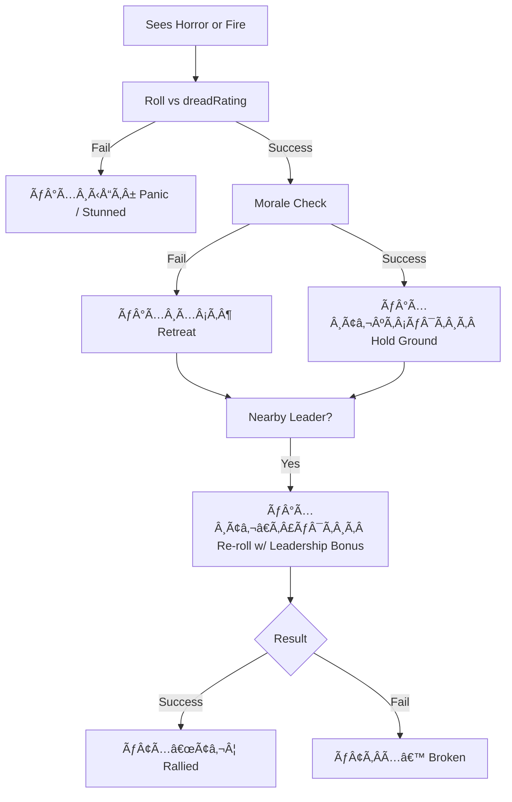
```mermaid
flowchart TD
    Encounter[Sees Horror or Fire] --> HorrorRoll[Roll vs dreadRating]
    HorrorRoll -->|Fail| Panic[😱 Panic / Stunned]
    HorrorRoll -->|Success| MoraleCheck[Morale Check]
    MoraleCheck -->|Fail| Retreat[🚶 Retreat]
    MoraleCheck -->|Success| Steady[🛡️ Hold Ground]
    Retreat --> RallyCheck[Nearby Leader?]
    Steady --> RallyCheck
    RallyCheck -->|Yes| ReRoll[🗣️ Re-roll w/ Leadership Bonus]
    ReRoll --> NewState{Result}
    NewState -->|Success| Rallied[✅ Rallied]
    NewState -->|Fail| Broken[❌ Broken]
```

---

### 🏰 8. Chain of Command Influence

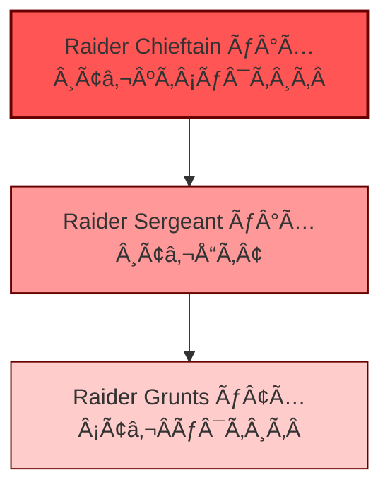
```mermaid
graph TD
    Commander[Raider Chieftain 🛡️] --> Sergeant[Raider Sergeant 📢]
    Sergeant --> Troops[Raider Grunts ⚔️]
    style Commander fill:#ff5555,stroke:#660000,stroke-width:2px
    style Sergeant fill:#ff9999,stroke:#660000,stroke-width:1.5px
    style Troops fill:#ffcccc,stroke:#660000
```

Leadership propagates morale bonuses through hierarchy; losing a leader breaks the chain.

---

### 😈 9. Fear & Command Aura Interaction

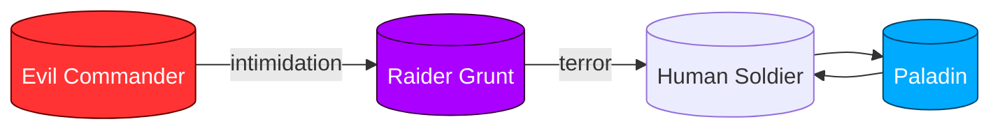
```mermaid
graph LR
    Raider[(Raider dreadRating16)]:::fear --> |terror| Human[(Human Soldier)]
    EvilLeader[(Evil Commander)]:::command --> |intimidation| Raider[(Raider Grunt)]
    Human --> Paladin[(Paladin)]:::leadership
    Paladin --> Human
    classDef fear fill:#aa00ff,stroke:#330033,color:#fff
    classDef command fill:#ff3333,stroke:#660000,color:#fff
    classDef leadership fill:#00aaff,stroke:#004466,color:#fff
```

Overlapping fear and leadership create contested morale checks.

---

### ⚖️ 10. Aura Conflict Resolution Flow

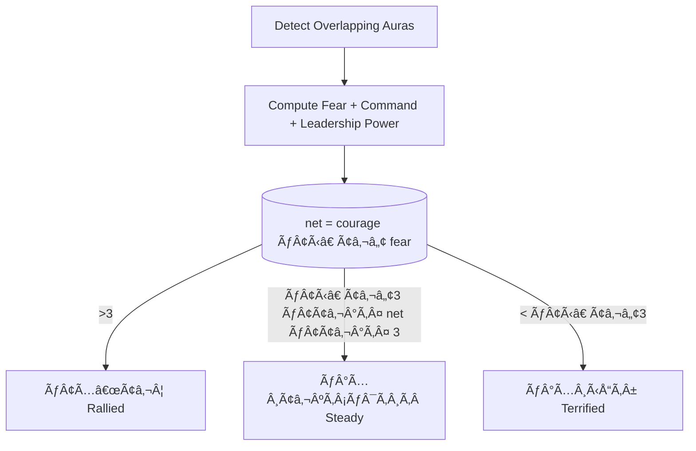
```mermaid
flowchart TD
    Detect[Detect Overlapping Auras] --> Calculate[Compute Fear + Command + Leadership Power]
    Calculate --> Net[(net = courage − fear)]
    Net -->|>3| Rallied[✅ Rallied]
    Net -->|−3 ≤ net ≤ 3| Steady[🛡️ Steady]
    Net -->|< −3| Terrified[😱 Terrified]
```

---

### 🔄 11. Complete System Interplay

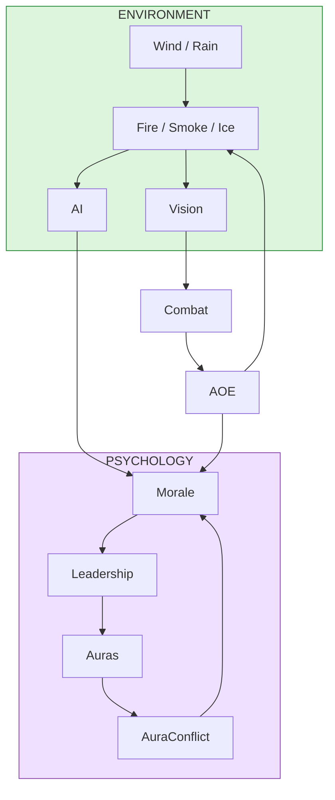
```mermaid
graph TD
    subgraph ENVIRONMENT
      Weather[Wind / Rain] --> Hazards
      Hazards[Fire / Smoke / Ice] --> Vision
      Hazards --> AI
    end

    subgraph PSYCHOLOGY
      AI --> Morale
      Morale --> Leadership
      Leadership --> Auras
      Auras --> AuraConflict
      AuraConflict --> Morale
    end

    Vision --> Combat
    Combat --> AOE
    AOE --> Hazards
    AOE --> Morale

    style ENVIRONMENT fill:#ddf5dd,stroke:#228833
    style PSYCHOLOGY fill:#f0e0ff,stroke:#8844aa
```

---

### 💾 12. System Architecture Map

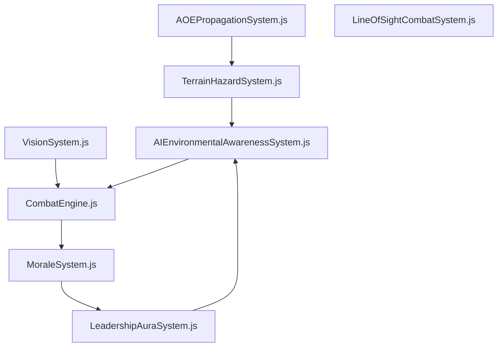
```mermaid
graph TD
  AOE[AOEPropagationSystem.js]
  LOS[LineOfSightCombatSystem.js]
  VIS[VisionSystem.js]
  HAZ[TerrainHazardSystem.js]
  AI[AIEnvironmentalAwarenessSystem.js]
  MOR[MoraleSystem.js]
  LEAD[LeadershipAuraSystem.js]
  COM[CombatEngine.js]

  HAZ --> AI
  VIS --> COM
  AOE --> HAZ
  COM --> MOR
  MOR --> LEAD
  LEAD --> AI
  AI --> COM
```

---

## ✅ Visual Legend

| Symbol | Meaning                     |
| ------ | --------------------------- |
| 🔥     | Fire tile / burning area    |
| 🌫️     | Smoke / fog blocking LoS    |
| ⚔️     | Combat / attack phase       |
| 🧠     | Morale or AI reasoning step |
| 🗣️     | Leadership or rally event   |
| 😱     | Fear / dread rating check  |
| 🏰     | Chain-of-command effect     |
| ⚖️     | Aura conflict resolution    |
| 💨     | Wind / weather system       |

---

These diagrams supplement the main README, providing quick-reference visuals for the systems you can expect when piloting the Medieval Combat Simulator Tactical Engine.

## 📎 Astaminandix: Visual Diagrams

The following SVG diagrams live under `docs/assets/` and can be embedded in documentation or rendered inline.


Each SVG is vector-scaled and can be customized (colors, labels) via any SVG editor. Aligning them with the 3D board is as simple as keeping the same flat-top hex proportions (≈30 px per hex edge).
