# Palladium Fantasy Character Creator & Game Master

A comprehensive full-stack RPG gaming platform inspired by the Palladium Fantasy RPG system. This application allows players to create characters, form parties, manage inventory, engage in combat, interact with NPCs, and play with an AI-powered Game Master.

## 🎮 Features

### Character Creation & Management

- **Species Selection**: Choose from 15+ fantasy races including Humans, Elves, Dwarves, Wolfen, Trolls, Ogres, and more
- **Advanced Attribute Rolling**:
  - Species-specific dice rolls (3d6, 4d6, 5d6)
  - Bonus dice for exceptional rolls (highlighted attributes)
  - Auto-roll feature with minimum total targeting
  - Cryptographic randomness option for true RNG
- **O.C.C. (Occupational Character Class) System**:
  - Men of Arms: Soldier, Mercenary, Knight, Paladin, Ranger, Long Bowman, Thief, Assassin
  - Men of Magic: Wizard, Warlock, Diabolist, Summoner, Illusionist, Witch
  - Clergy: Priest of Light, Priest of Darkness, Druid, Shaman, Healer
  - Psionic: Mind Mage
  - Optional: Scholar, Merchant, Noble, Peasant, Squire
- **Dynamic Class Filtering**: Automatic filtering based on race restrictions and attribute requirements
- **Skill System**:
  - O.C.C. Skills (automatic)
  - Elective Skills (class-specific choices)
  - Secondary Skills (general skills pool)
  - Level-based skill progression
- **Character Backgrounds**:
  - Social Background
  - Disposition
  - Personal Hostility
  - Land of Origin
  - Age determination by species
- **Level Progression System (1-15)**:
  - HP progression by level
  - Attacks per melee increase
  - Combat bonuses (strike, parry, dodge, damage)
  - Saving throws improvements
  - PPE/ISP growth for magic users
  - Skill increases at specific levels
- **Bulk Character Generation**: Create multiple NPCs or party members at once

### Party System

- **Party Management**: Create and manage adventuring parties
- **Party Builder**: Assign characters to parties
- **Party Inventory**: Shared inventory and resource management
- **Party Chat**: Group communication system
- **Party-based Quests**: Track party objectives and progress

### Combat System

- **Initiative Tracker**: Automated turn order based on character speed and bonuses
- **Combat Actions**:
  - Strike, Parry, Dodge mechanics
  - Critical hits and fumbles
  - Called shots
  - Multiple attacks per melee round
- **Combat Panel**: Real-time combat management interface
- **Combat Spells**: Integrated spell casting in combat
- **Combat Logs**: Historical record of battles
- **Damage Tracking**: Automatic HP management

### Equipment & Economy

- **Equipment Shop**: Purchase weapons, armor, and gear
- **Weapon Shop**: Specialized weapon marketplace with stats
- **Trader Shop**: General goods and supplies
- **Merchant System**: NPC merchants with dynamic inventory
- **Starting Equipment**: Class-based initial gear
- **Inventory Management**:
  - Carry weight calculations based on PS
  - Equipment slots
  - Item quality and condition
- **Currency System**: Gold-based economy with class-specific starting funds

### Magic & Psionics

- **Spell System**:
  - Multiple spell levels and types
  - PPE (Potential Psychic Energy) tracking
  - Spell casting interface
  - Combat and utility spells
- **Psionics System**:
  - ISP (Inner Strength Points) tracking
  - Psionic abilities
  - Mind Mage powers
  - IQ-based psionic potential rolls

### AI Game Master

- **OpenAI Integration**: GPT-powered Game Master
- **RAG System** (Retrieval-Augmented Generation):
  - Vector embeddings for game rules
  - Semantic search for rulebook queries
  - Context-aware responses
- **Dynamic Storytelling**: AI-generated quests and narratives
- **NPC Interactions**: Intelligent NPC dialogue and behavior
- **NPC Memory System**: Persistent NPC memory of interactions
- **Quest Generation**: Automated quest creation and tracking

### World & Exploration

- **Interactive World Map**: 3D globe visualization with locations
- **Starting Locations**: Multiple campaign starting points
- **Encounter System**: Random and scripted encounters
- **Encounter Tables**: Level-appropriate challenges
- **Bestiary**: Comprehensive monster database with stats
- **Time Tracking**: In-game time and calendar system
- **Rest System**: Short and long rest mechanics

### User System

- **User Authentication**: Secure login/registration
- **JWT Token-based Auth**: Protected routes and sessions
- **Character Lists**: Personal character library
- **User Profiles**: Track player progress and characters

### Data & Content

- **Comprehensive Rules Database**:
  - Race data with bonuses and abilities
  - O.C.C. data with skills and progression
  - Skills database with descriptions
  - Weapons and armor stats
  - Combat actions reference
  - Movement rules
  - Spell compendium
  - Bestiary (dragons, giants, monsters)
  - NPC archetypes and templates
- **Preprocessed Datasets**: Optimized for AI queries (JSON, JSONL, TXT, MD formats)
- **Cross-references**: Linked game rules and mechanics

## 🛠️ Technology Stack

### Frontend

- **React 18**: Component-based UI framework
- **Vite**: Fast build tool and dev server
- **React Router**: Client-side routing
- **Chakra UI**: Modern component library
- **Three.js**: 3D world map visualization
- **CSS Modules**: Scoped styling

### Backend

- **Node.js**: Runtime environment
- **Express.js**: Web application framework
- **MongoDB**: NoSQL database
- **Mongoose**: MongoDB ODM
- **OpenAI API**: AI Game Master integration
- **Swagger**: API documentation

### AI & RAG

- **OpenAI Embeddings**: Vector embeddings for semantic search
- **Pinecone/Vector DB**: Vector storage for RAG
- **Custom Prompt Engineering**: Game Master personality and rules
- **Context Management**: Conversation history and memory

### Authentication & Security

- **JWT**: JSON Web Tokens for auth
- **bcrypt**: Password hashing
- **Express middleware**: Auth guards and validation

## 📁 Project Structure

```
charcreat/
├── backend/
│   ├── config/          # Database configuration
│   ├── controllers/     # Route controllers
│   ├── data/            # Game data (JSON)
│   ├── middleware/      # Auth, validation, error handling
│   ├── models/          # Mongoose schemas
│   ├── routes/          # API endpoints
│   ├── scripts/         # Utility scripts (seeding, building indices)
│   ├── server/
│   │   ├── prompt/      # AI prompt templates
│   │   ├── rag/         # RAG implementation
│   │   └── tools/       # AI tools and functions
│   ├── shared/          # Shared utilities
│   └── server.js        # Entry point
│
├── src/
│   ├── components/      # React components
│   ├── context/         # React context providers
│   ├── data/            # Frontend game data
│   ├── engine/          # Game logic (encounters, etc.)
│   ├── hooks/           # Custom React hooks
│   ├── pages/           # Page components
│   ├── services/        # API services
│   ├── styles/          # CSS files
│   ├── utils/           # Utility functions
│   └── main.jsx         # React entry point
│
├── public/              # Static assets
├── exports/             # Character exports
└── scripts/             # Build scripts
```

## 🚀 Getting Started

### Prerequisites

- Node.js (v16 or higher)
- MongoDB (local or Atlas)
- OpenAI API key (for AI Game Master features)

### Installation

1. **Clone the repository**

```bash
git clone <repository-url>
cd charcreat
```

2. **Install dependencies**

```bash
# Install backend dependencies
cd backend
npm install

# Install frontend dependencies
cd ..
npm install
```

3. **Environment Configuration**

Create a `.env` file in the `backend` directory:

```env
MONGODB_URI=mongodb://localhost:27017/palladium
JWT_SECRET=your_jwt_secret_here
OPENAI_API_KEY=your_openai_api_key_here
PORT=5000
```

4. **Seed the database** (optional)

```bash
cd backend
node scripts/reseedShop.js
node scripts/reseedWeapons.js
node scripts/buildGMIndex.js  # Build RAG index
```

5. **Run the application**

Backend:

```bash
cd backend
npm start
```

Frontend:

```bash
npm run dev
```

Access the application at `http://localhost:5173`

## 🎲 How to Play

### Creating a Character

1. Navigate to **Character Creation**
2. Enter a character name and select gender
3. Choose a **species** (each has unique attributes)
4. Select **alignment** (Good, Selfish, or Evil)
5. **Roll attributes** (or use auto-roll for minimum totals)
6. **Roll bonus dice** for exceptional attributes
7. Roll **background information** (age, social background, disposition, etc.)
8. Roll for **psionics** (if applicable)
9. Select an **O.C.C.** (filtered by race and attributes)
10. Choose **skills** (elective and secondary)
11. Set your **character level** (1-15) to see projected stats
12. **Create character** to save to database

### Building a Party

1. Go to **Party Builder**
2. Create a new party
3. Add characters from your character list
4. Manage party inventory and resources
5. Use **Party Chat** for roleplay

### Using the AI Game Master

1. Navigate to **GM Assistant**
2. Start a conversation with the AI
3. Ask about rules, request quests, or interact with NPCs
4. The GM uses RAG to reference official rules
5. NPC memories persist across sessions

### Combat

1. Use the **Combat Panel** to initiate encounters
2. **Initiative Tracker** automatically orders turns
3. Select combat actions from the **Combat Actions Panel**
4. Track HP, damage, and status effects
5. View **Combat Log** for battle history

### Shopping & Equipment

1. Visit **Equipment Shop**, **Weapon Shop**, or **Trader Shop**
2. Browse items with full stats
3. Purchase gear (checks gold and carry weight)
4. Manage inventory in **Inventory Manager**

## 🗺️ Game Features

### Races Available

Human, Elf, Dwarf, Gnome, Wolfen, Kobold, Goblin, Hob-Goblin, Orc, Ogre, Troll, Troglodyte, Changeling, Faerie, Sprite

### Combat Mechanics

- **Attacks per Melee**: Increases with level and skills
- **Bonuses**: Strike, Parry, Dodge, Damage, Initiative
- **Saving Throws**: vs Magic, Poison, Psionics, Horror
- **Critical Hits**: Natural 20 mechanics
- **Called Shots**: Target specific body parts

### Character Progression

- **15 Levels** with distinct power increases
- **HP Growth**: Based on PE and level
- **Skill Percentages**: Improve with IQ bonuses and level
- **Combat Prowess**: More attacks and better bonuses
- **Magic Power**: PPE increases for spellcasters
- **Psionic Strength**: ISP grows for psychics

## 📚 API Documentation

API documentation is available via Swagger UI when the backend is running:

```
http://localhost:5000/api-docs
```

### Main Endpoints

- `/api/users` - User management
- `/api/characters` - Character CRUD operations
- `/api/parties` - Party management
- `/api/shop` - Shop and merchants
- `/api/chat` - AI Game Master chat
- `/api/npc` - NPC interactions
- `/api/combat` - Combat logging

## 🧪 Scripts

### Backend Scripts

- `buildGMIndex.js` - Build vector embeddings for RAG
- `reseedShop.js` - Reset shop inventory
- `reseedWeapons.js` - Reset weapon shop
- `clearShop.js` - Clear all shops
- `seedItems.js` - Seed items database
- `checkWeapons.js` - Validate weapon data

## 🎨 UI Components

### Core Components

- **CharacterCreator** - Full character creation wizard
- **CharacterList** - Browse and manage characters
- **PartyBuilder** - Create and manage parties
- **GMAssistant** - AI Game Master interface
- **CombatPanel** - Combat encounter management
- **EquipmentShop** - Shop interface
- **WorldMap** - 3D interactive map
- **NPCChat** - Talk to NPCs
- **QuestTracker** - Track active quests
- **BestiaryPanel** - Monster reference
- **InitiativeTracker** - Turn order in combat

## 🤝 Contributing

This is a fan project based on Palladium Fantasy RPG rules. Contributions are welcome!

## ⚖️ Legal & Acknowledgments

### Disclaimers

- This project is a **fan creation** and is **not affiliated with or endorsed by Palladium Books**.
- Game mechanics, species attributes, and rules are based on the Palladium Fantasy RPG system published by Palladium Books.
- All game rules and mechanics are property of Palladium Books.
- This project is for **educational and entertainment purposes only**.

### Credits

- **Palladium Books** - Original RPG system and rules
- **OpenAI** - GPT models for AI Game Master
- **ChatGPT** - Assisted in code generation and project structure
- Community contributors and playtesters

## 📄 License

This project is open-source and available under the MIT License for the code. Game content and rules remain property of Palladium Books.

---

**Version**: 2.0  
**Last Updated**: 2025  
**Game System**: Palladium Fantasy RPG (based on 1st/2nd Edition rules)

## 🧭 Appendix — System Diagrams

### ⚙️ 1. Combat Round Flow Overview


---

### 👁️ 2. Line of Sight and Shared Vision


Allies share any enemy detected by linked party members.

---

### 💥 3. AoE Spell Propagation


Propagation halts when it hits cover ≥ 0.8 (rock, cliff, etc.).

---

### 🌋 4. Fire and Smoke Spread (per Turn)

```mermaid
flowchart LR
    FireTile((🔥)) -->|35% chance| Forest1🌲
    FireTile -->|50% chance| Smoke1(🌫️)
    Smoke1 -->|spread| Smoke2(🌫️)
    FireTile -.blocked by water/rock.-> Stop
    style FireTile fill:#ff6600,stroke:#993300
```

Fire ignites adjacent flammables; smoke expands unless blocked. Wind/humidity modify spread odds.

---

### 🌬️ 5. Wind & Weather Influence

```mermaid
graph TD
    WindDir((Wind Vector)) --> FireSpread[🔥 Fire Spread Direction]
    WindDir --> SmokeDrift[🌫️ Smoke Drift]
    Rain[☔ Rain / Humidity] -->|reduces| FireSpread
    Rain -->|extinguish| FireTile
    style WindDir fill:#99ccff,stroke:#0066aa
    style Rain fill:#aaccee,stroke:#004477
```



---

### 🤖 6. AI Environmental Awareness


---

### 🧠 7. Morale & Leadership Flow

```mermaid
flowchart TD
    Encounter[Sees Horror or Fire] --> HorrorRoll[Roll vs Horror Factor]
    HorrorRoll -->|Fail| Panic[😱 Panic / Stunned]
    HorrorRoll -->|Success| MoraleCheck[Morale Check]
    MoraleCheck -->|Fail| Retreat[🚶 Retreat]
    MoraleCheck -->|Success| Steady[🛡️ Hold Ground]
    Retreat --> RallyCheck[Nearby Leader?]
    Steady --> RallyCheck
    RallyCheck -->|Yes| ReRoll[🗣️ Re-roll w/ Leadership Bonus]
    ReRoll --> NewState{Result}
    NewState -->|Success| Rallied[✅ Rallied]
    NewState -->|Fail| Broken[❌ Broken]
```



---

### 🏰 8. Chain of Command Influence

```mermaid
graph TD
    Commander[Orc Chieftain 🛡️] --> Sergeant[Orc Sergeant 📢]
    Sergeant --> Troops[Orc Grunts ⚔️]
    style Commander fill:#ff5555,stroke:#660000,stroke-width:2px
    style Sergeant fill:#ff9999,stroke:#660000,stroke-width:1.5px
    style Troops fill:#ffcccc,stroke:#660000
```



Leadership propagates morale bonuses through hierarchy; losing a leader breaks the chain.

---

### 😈 9. Fear & Command Aura Interaction


Overlapping fear and leadership create contested morale checks.

---

### ⚖️ 10. Aura Conflict Resolution Flow

```mermaid
flowchart TD
    Detect[Detect Overlapping Auras] --> Calculate[Compute Fear + Command + Leadership Power]
    Calculate --> Net[(net = courage − fear)]
    Net -->|>3| Rallied[✅ Rallied]
    Net -->|−3 ≤ net ≤ 3| Steady[🛡️ Steady]
    Net -->|< −3| Terrified[😱 Terrified]
```



---

### 🔄 11. Complete System Interplay


---

### 💾 12. System Architecture Map


---

## ✅ Visual Legend

| Symbol | Meaning                     |
| ------ | --------------------------- |
| 🔥     | Fire tile / burning area    |
| 🌫️     | Smoke / fog blocking LoS    |
| ⚔️     | Combat / attack phase       |
| 🧠     | Morale or AI reasoning step |
| 🗣️     | Leadership or rally event   |
| 😱     | Fear / Horror factor check  |
| 🏰     | Chain-of-command effect     |
| ⚖️     | Aura conflict resolution    |
| 💨     | Wind / weather system       |

---

These diagrams supplement the main README, providing quick-reference visuals for the systems you can expect when piloting the Palladium Tactical Engine.

## 📎 Appendix: Visual Diagrams

The following SVG diagrams live under `docs/assets/` and can be embedded in documentation or rendered inline.


Each SVG is vector-scaled and can be customized (colors, labels) via any SVG editor. Aligning them with the 3D board is as simple as keeping the same flat-top hex proportions (≈30 px per hex edge).
